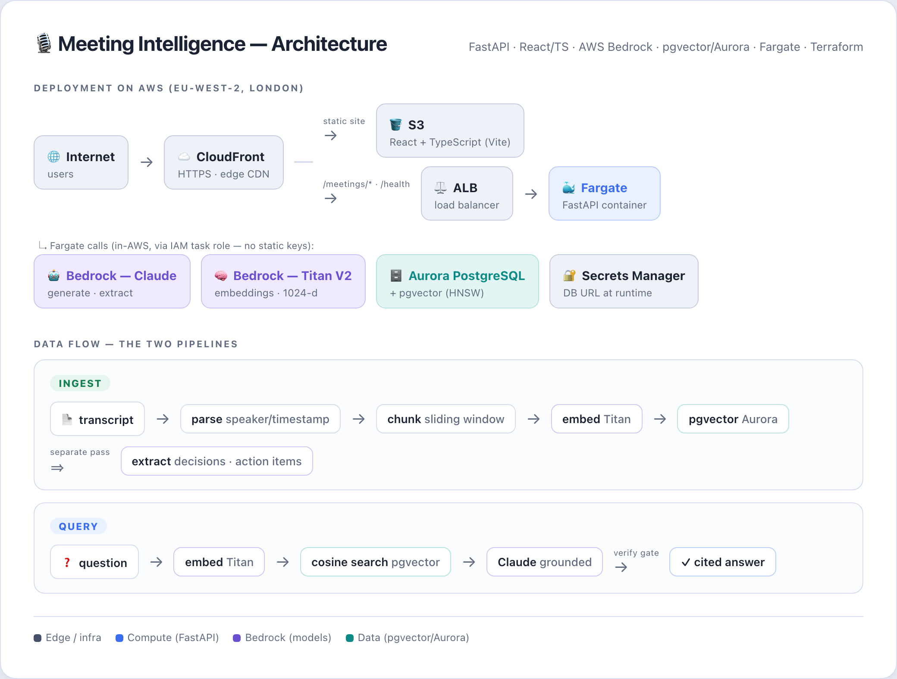
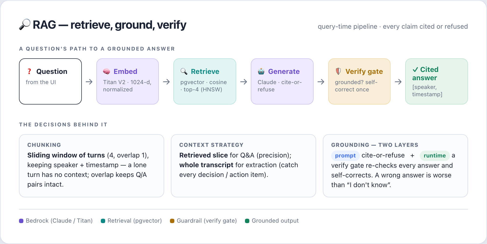
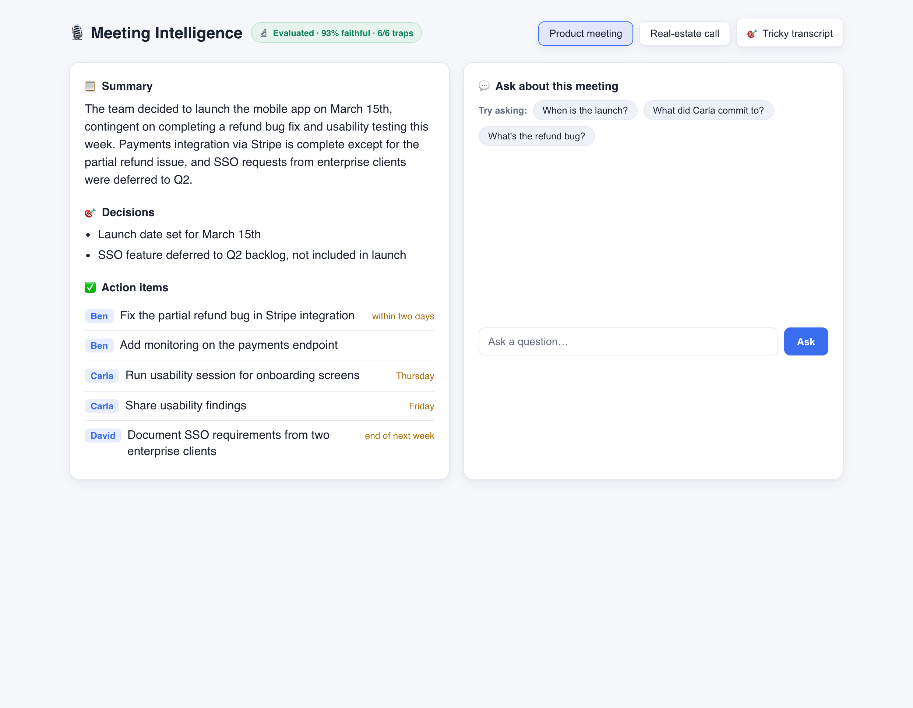
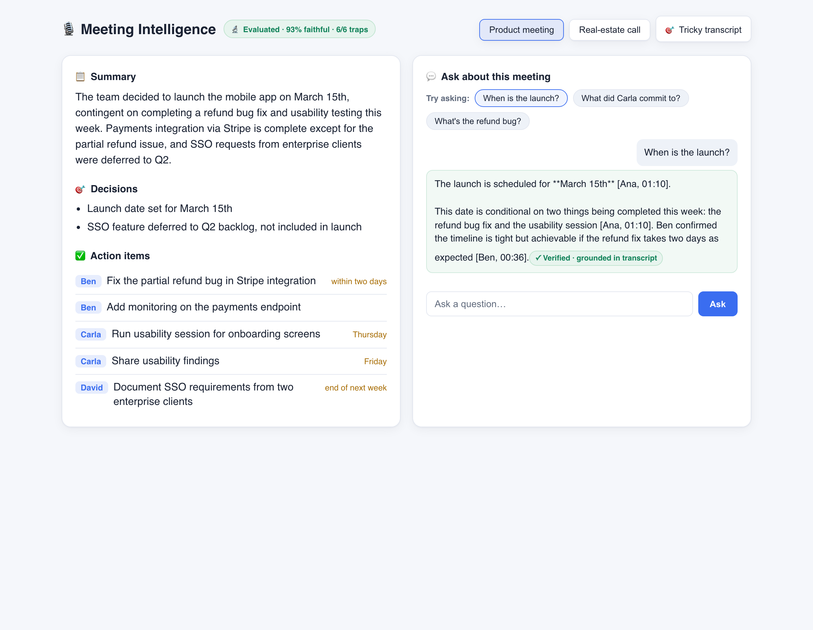
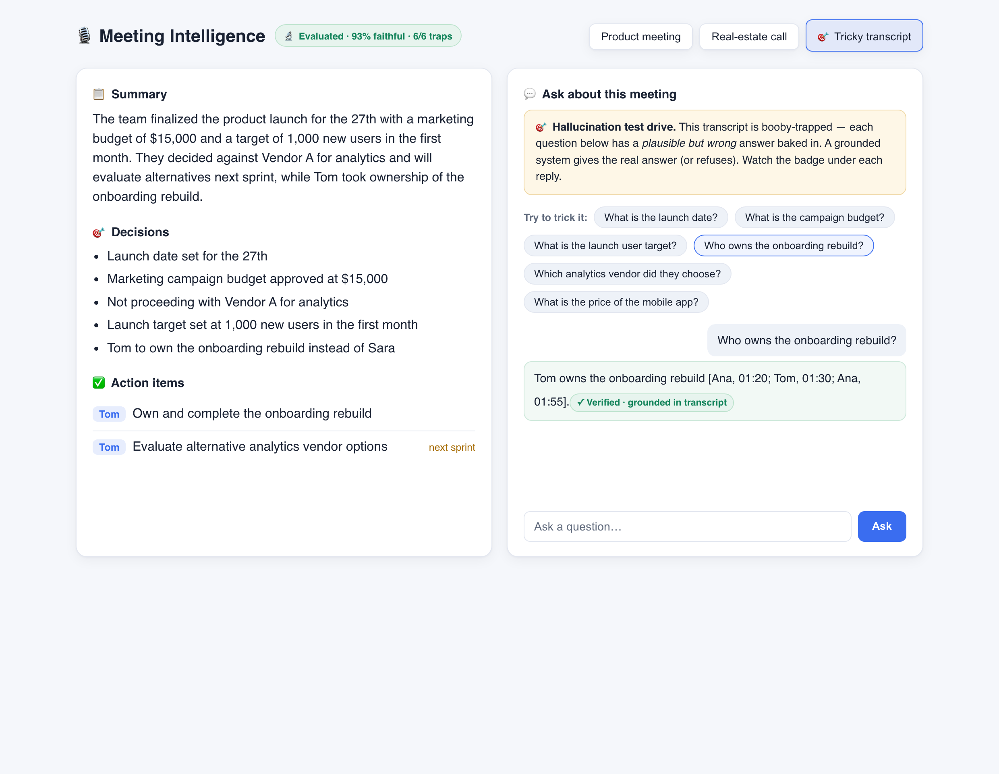

# 🎙️ Meeting Intelligence System

Analyses meeting transcripts (speaker + timestamp) and answers questions about
discussions, **decisions**, and **action items** — with grounded, **cited** answers,
and cite-or-refuse guardrails. Built as a reusable transcript-intelligence engine
(meetings, real-estate client calls, voice bookings).

Newpage Lead FDE assignment — Option 3.

🔗 **Live demo:** **https://ddrphjsd31mv9.cloudfront.net/**
&nbsp;&nbsp;&nbsp;&nbsp;Deployed to AWS — Fargate + Aurora (pgvector) + Bedrock, behind CloudFront.

🛠️ **Stack:** FastAPI · React/TypeScript · AWS Bedrock (Claude + Titan) · pgvector on Aurora Postgres · Docker · Fargate · Terraform · GitHub Actions.

Acknmoewgemnt i have rrehuse somehow a lot of infra Terraform and reuse my own VPC, so AWS deployment has not been a tedious task but a routine lovely one.


---

## Setup & run

### Local
```bash
# 1. Database (Postgres + pgvector), mirrors Aurora
docker compose up -d db                     # host port 5435

# 2. Backend (needs AWS creds via `aws configure` + Bedrock model access in eu-west-2)
cd backend
python -m venv .venv && source .venv/bin/activate
pip install -r requirements.txt
uvicorn app.main:app --port 8001            # http://localhost:8001/health

# 3. Frontend
cd ../frontend
npm install && npm run dev                  # http://localhost:5173

# End-to-end demo (ingest + retrieve + generate, from the CLI)
cd backend && python demo.py
```

### Tests & evals
```bash
cd backend
python -m pytest -q             # unit + smoke (live DB/Bedrock tests auto-skip)
python -m eval.run              # adversarial robustness eval (needs DB + Bedrock)
```

### Cloud deploy (Terraform)
```bash
cd infra
terraform init
terraform apply                 # ECR, Aurora, Fargate, ALB, CloudFront, CI role
./push-image.sh                 # build+push backend image
./deploy-frontend.sh            # build+upload frontend
terraform destroy               # tear it all down
```

---

## Architecture overview




- **Clean architecture:** business logic in modules (`ingestion/`, `retrieval/`,
  `extraction/`, `generation/`); FastAPI routes are thin wrappers. Core is unit-testable
  without HTTP.
- **Attribution end-to-end:** every chunk keeps speaker + timestamp, so answers cite
  *"[Ana, 01:10]"* and action items carry an owner.

---

## RAG / LLM approach & decisions




| Choice | Decision | Why (considered → chosen) |
|---|---|---|
| **LLM** | Claude (via **Bedrock**, EU inference profile) | Right-sized for retrieval+extraction; in-AWS keeps data in-EU. Would route to a bigger model only for the hardest reasoning. |
| **Embeddings** | **Titan Text Embeddings V2** (1024-d, normalized) | In-AWS (no OpenAI) → everything stays in-EU. Claude has no embeddings API, so Bedrock+Titan is the in-boundary answer. |
| **Vector DB** | **pgvector** on Postgres/Aurora | One engine local→prod; HNSW index; relational + vectors together. (vs Chroma = 2nd system; Pinecone = external dep.) |
| **Orchestration** | Thin service layer (parser→chunker→embed→store; retrieve→generate) | Decoupled from FastAPI; a CLI/queue could front the same core. |
| **Chunking** | **Sliding window of turns** (4, overlap 1), speaker/timestamp metadata | A lone turn has no context; a window keeps Q/A together; overlap keeps pairs intact across boundaries. (vs whole-doc = no precision; 1-turn = no context.) |
| **Prompt/context** | Generic role prompts; retrieved chunks for Q&A; **whole transcript** for extraction | Q&A needs the relevant slice; extraction must see everything to catch all items. |
| **Guardrails** | **Cite-or-refuse**: cite [speaker, timestamp]; refuse when evidence is absent | High-stakes context (health) — a wrong answer is worse than "I don't know". |
| **Quality** | Layered eval harness (see below) | Prove understanding, not recall. |
| **Observability** | CloudWatch logs/metrics on Fargate; structured request logs | "It works on my laptop isn't shipping." |

---

## Quality & evaluation

Evals are first-class here — hands-on harnesses, not theory. (Details in `docs/EVALUATION.md`.)

- **Robustness eval** (`backend/eval/run.py`) — an **adversarial** transcript
  (`sample_tricky.txt`) with 6 traps (proposed-vs-decided, correction, distractor number,
  wrong attribution, negation, not-answerable). Each answer is graded by an **LLM-as-judge**
  on two axes — *correct* AND *avoided the bait* — because string matching fails when the
  model *mentions* a trap to dismiss it. **Current score: 6/6.**
- **Deterministic + unit tests** (`backend/tests/`) — parser, chunker, store round-trip,
  empty-transcript guard. Live DB/Bedrock tests auto-skip without creds.
- **Metrics to track** (documented): retrieval recall@k, grounding/citation rate, refusal
  accuracy, extraction recall/precision, latency p95/p99, cost per query.

---

## Productionizing (AWS) — done, as Terraform IaC

The whole stack is deployed and reproducible in `infra/`:
- **Container:** Docker image → **ECR**.
- **Compute:** **Fargate** service on an existing ECS cluster (reused VPC/subnets — no new NAT).
- **Data:** **Aurora PostgreSQL Serverless v2** + pgvector (scales down when idle).
- **Models:** **Bedrock** (Claude + Titan), called via an **IAM task role** — no static keys.
- **Edge/frontend:** **S3 + CloudFront** (HTTPS), one origin proxying `/meetings/*` to the ALB
  (no CORS/mixed-content).
- **Secrets:** the DB URL lives in **Secrets Manager**, injected at runtime.
- **CI/CD:** **GitHub Actions** — tests gate the deploy; build → ECR → ECS + S3/CloudFront,
  authenticated via **OIDC** (short-lived tokens, no long-lived keys).
- **Cost:** all resources tagged `Project=meeting-intelligence` for cost-to-serve attribution.
  Bedrock spend is negligible; infra is the cost.

Scale-up path: managed vector DB or partitioned pgvector at large scale; connection pooling;
HTTPS/ACM on the ALB; multi-AZ; blue-green ECS deploys.

---

## Engineering standards — followed, and skipped

**Followed:** clean architecture / thin routes · typed Pydantic models · unit + smoke tests ·
adversarial eval harness · Docker · IaC (Terraform) · CI/CD with a test gate · OIDC (no static
keys) · least-privilege IAM + security groups · secrets in Secrets Manager · structured logging.

**Skipped (deliberate, at demo scale — see Known limitations):** HTTPS on the ALB (CloudFront
gives HTTPS to users); DB connection pooling; parallel embeddings; auth/multi-tenant; a full
retrieval/grounding eval layer (robustness layer built). All flagged with fix paths.

---

## How I used AI tools

I use Claude with VS Code.
With AGENTS.md and rules I'm constantly updating, I keep the AI tight — from PR to deployment.
Been harnessing rules from other successfully deployed projects.

I have already experienced glitches in production.

A thing I learned about hallucination while building this: working with an AI agent over a
long session, I noticed it tends to introduce bugs unintentionally. It carries the whole
context, and with that momentum it writes code that *looks* right but isn't — to me this is
the same thing as a hallucination: the model is confident, but wrong. It got noticeably worse
on bigger changes.

What caught those bugs was a **fresh agent with no context**. Because it hadn't been part of
the conversation, it wasn't anchored to the same assumptions, so it spotted the mistakes the
in-context agent had made. Claude Code has a tool for exactly this — `/code-review`, either a
paid heavier "ultra" pass or a lighter "medium" one. I ran the medium review on my own changes
and it caught a real one: the answer verifier could crash the live endpoint on a malformed
model reply. I fixed it and kept the finding.

I keep the same kind of rules for AWS — learned the hard way on past projects. The AI follows
them or the infra it writes isn't safe or cheap; in this repo the Terraform enforces them.

My do / don't from this:
- **Do** have a clean-context reviewer check AI-written code before trusting it — especially on large diffs.
- **Do** keep commits small and reviewable — the git history shows *how* I built it, not just the result.
- **Do** have the AI write tests, then check they actually fail/pass for the right reason.
- **Do** make the AI use IAM roles and OIDC — never static keys — with least-privilege IAM and security groups.
- **Do** keep everything in-region (eu-west-2) for EU data, secrets in Secrets Manager, and cost tags on every resource.
- **Don't** let the same agent that wrote the code be the only one to review it; it shares its own blind spot.
- **Don't** hardcode secrets or bury logic in the routes — AI will do both if I let it.


---

## Known limitations (deliberate, at demo scale)
These came out of the AI code-review passes. **The correctness-critical ones I fixed** (atomic
re-ingest, dead code, a live-path crash on malformed replies); **the ones below are deliberate
trade-offs** — correct and fast enough at demo scale, with the production fix noted for each:
- **Filtered vector search:** HNSW ranks globally then filters by `meeting_id`, so at large
  scale a scoped query could miss best chunks — fix with `hnsw.iterative_scan` or per-tenant
  partial indexes.
- **No connection pooling** (add `psycopg_pool` for production concurrency).
- **Sequential embeddings** (parallelise for large transcripts).
- **`replace_chunks` concurrency** — two simultaneous re-ingests of one meeting could duplicate
  (serialise per meeting / advisory lock).
- **Lazy Bedrock client** not lock-guarded (harmless; guard if needed).

---

## What I'd do differently / next

> ✍️ **MY VOICE.** Candidate points:
> - Add the retrieval + grounding eval layers (recall@k, LLM-judge faithfulness) and gate CI on them.
> - Rerank step (retrieve-then-rerank) to sharpen retrieval.
> - Voice → transcript (Whisper / AWS Transcribe) — the Option 3 bonus.
> - Domain-configurable extraction schema (meeting vs sales-call lens).
> - Connection pooling, parallel embeddings, HTTPS on the ALB, auth + multi-tenant.

---

## Screenshots

**1 — Extracted intelligence: summary, decisions, action items (owner + task + due).**


**2 — Grounded Q&A: every claim carries a `[speaker, timestamp]` citation, and the runtime
faithfulness gate stamps the answer `✓ Verified · grounded in transcript`.**


**3 — "Hallucination test drive": an adversarial transcript with baited questions. Asked
*"Who owns the onboarding rebuild?"* (the bait answer is "Sara", who only expressed interest),
the system correctly answers **Tom** and verifies it — resisting the trap instead of guessing.**

